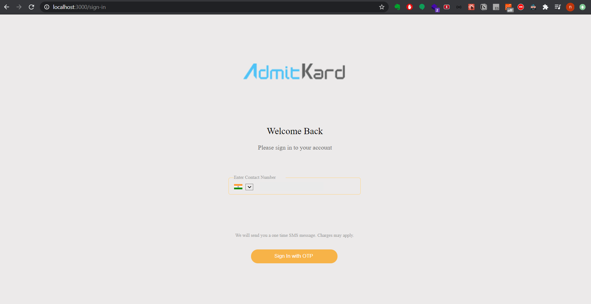
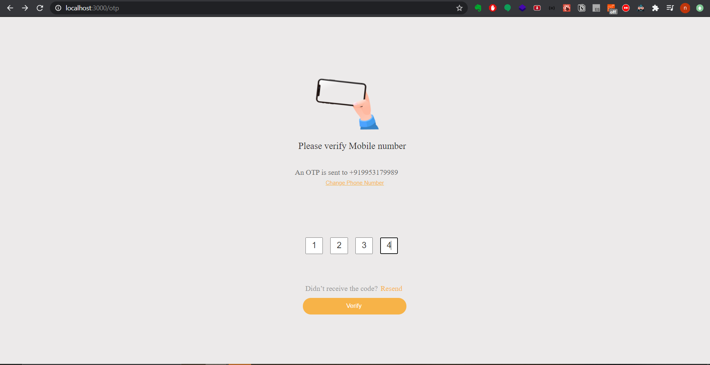
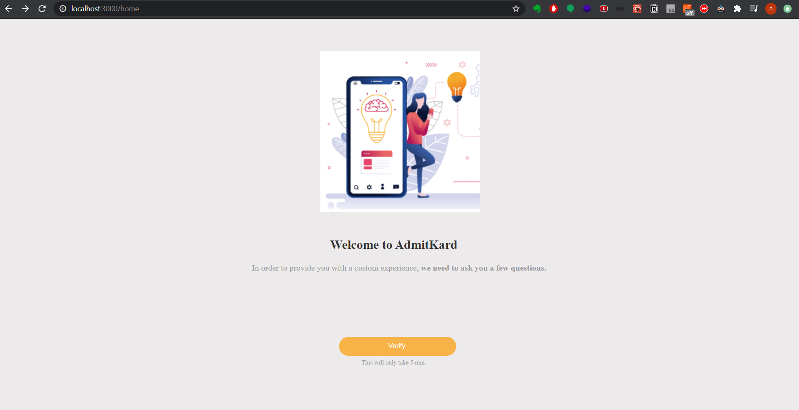

# FrontEnd - Otp Login
# About
Login, OTP and success screen. 

# How to Use
1. Clone this project
2. Enter these commands
```
npm install
npm start
```
3. Clone the below project
```
https://github.com/NamanJindal03/otp-login-backend
```
4. In the above project enter these commands
```
npm install
npm start
```
5. Your Project is ready

# Important
A static OTP of 1234 is kept, if 1234 is submitted it will be success else a wrong otp message will be displayed






